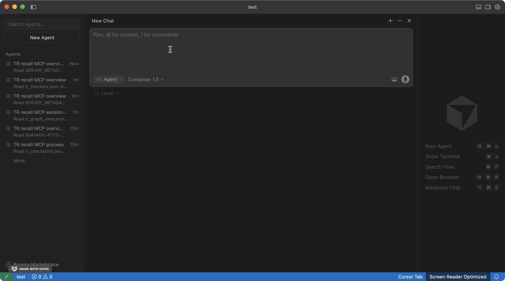

# Solving AI Amnesia: Transient Recall MCP

Every new chat window costs you **twice**.

**10–15 minutes** rebuilding what you were working on, what you tried, and why your decisions made sense.<sup>1</sup>  
**Tokens wasted** getting your AI back up to speed before it can actually help.

**Transient Recall** stores your full working context locally (goals, decisions, blockers, code state) in Postgres. Your AI calls `tr_resume` and continues from your last checkpoint. No re-explaining. Ever.



On first setup, index your Git history. TR backfills past commits into your project stream so your AI knows the full arc of the codebase from day one: why files exist, what was refactored and when, which bugs were fixed and how. The longer the history, the more grounded it gets.

Because TR is MCP-based and project-scoped, it goes well beyond a single session. Drop into a second repo and TR tracks that context independently. Switch between Cursor, Claude Desktop, or any MCP-compatible tool and the same checkpoint is waiting. Hand a feature to a teammate and they resume from your last saved state instead of asking you to walk them through it. Run multiple AI tools across multiple repos at once, each one grounded in its own project history, none of them starting blind.

<sup>1</sup> [Parnin & Rugaber, *Resumption Strategies for Interrupted Programming Tasks*, Software Quality Journal (2011)](https://chrisparnin.me/pdf/parnin-sqj11.pdf)

## Workflow continuity done right. 

- No more re-explaining your stack to every fresh chat window
- Cuts the token overhead of context reconstruction on every session start
- Context survives restarts, branch switches, and team handoffs
- Works with any MCP-compatible tool — Cursor, Claude Desktop, and others
- Runs entirely on your machine, nothing leaves your environment

## Website

- [Docs (TR setup & workflow)](https://transientintelligence.com/docs/transient-recall)

## When to use TI vs TR

| Use case | Best fit |
|----------|----------|
| Document Q&A with citations and evidence checks | Transient Intelligence (TI) |
| Cross-session continuity, handoffs, blockers, next actions | Transient Recall (TR) |
| Best end-to-end developer workflow | Use TI for evidence + TR for continuity |

## Prerequisites

- Docker (Desktop or CLI)
- A supported MCP client: Cursor, Claude Desktop, or any MCP-compatible tool

## Step 1 — Install

```bash
bash <(curl -fsSL https://transientintelligence.com/install/recall)
```

Pulls and starts the pinned TR Docker image with Postgres, runs database migrations, and prints ready-to-paste blocks for Cursor MCP config and the continuity rule.

## Step 2 — Configure your MCP client

Use the printed MCP config in your client settings, then reload MCP servers. Cursor: add to `.cursor/mcp.json` in your workspace root, or `~/.cursor/mcp.json` for global. Example:

```json
{
  "mcpServers": {
    "transient-recall-local": {
      "url": "http://localhost:8090/mcp",
      "headers": {
        "x-tr-subject": "local-dev-user",
        "x-tr-tenant": "public",
        "x-tr-project": "my-project"
      }
    }
  }
}
```

Set `x-tr-project` to your repo or project name. Keep it stable across restarts — continuity restore depends on the exact identity tuple: `x-tr-tenant`, `x-tr-subject`, and `x-tr-project`.

## Step 3 — Add continuity instructions

Paste the rule block from the install output into your AI agent. The agent creates rule files in `.cursor/rules/` (or your IDE's equivalent). If you missed the install output, the full rule content is in [Install and verify](docs/install-verify.md#3-add-continuity-instructions).

## Step 4 — Checkpoint

Ask your AI: *"Call tr_checkpoint with my current goal: getting TR set up and running."*

TR stores your goal, context, and session state in Postgres.

## Step 5 — Resume next session

At the start of any future session, ask: *"Call tr_resume for project: my-project"*

TR returns your last checkpoint — goal, decisions, files, blockers, next actions — and your AI picks up from there.

## Verify it is running

```bash
curl http://localhost:8090/healthz
# {"status":"ok"}
```

## Core MCP tools

| Tool | What it does |
|------|--------------|
| `tr_checkpoint` | Save current goal, decisions, context, and blockers |
| `tr_resume` | Load the latest context pack for a project |
| `tr_status` | Check system health and checkpoint stats |
| `tr_timeline` | Browse checkpoint events by project and date |
| `tr_projects` | List recent projects and suggest best match for your workspace |
| `tr_search_checkpoints` | Search checkpoints by keyword with optional project/time filters |
| `tr_blockers` | View open blockers for a project |
| `tr_graph_view` | View the knowledge graph for a project |
| `tr_graph_diff` | See what changed between checkpoints |

## Repository indexing (historical + live)

TR supports two continuity paths:

- **Live continuity:** ongoing `tr_checkpoint` calls from your AI (via the rules in Step 3).
- **Historical indexing:** backfill past commits into the same project stream using the TR Docker image.

Run backfill from your repo directory. Use `--idempotency_scope=repo` when combining multiple repos into one project.

```bash
docker run --rm \
  -v "${PWD}:/repo" \
  -e TR_MCP_BASE_URL="http://host.docker.internal:8090" \
  ghcr.io/jamesatyosage/transient-recall-api:v0.1.0 \
  node scripts/backfill-commits.mjs \
    --project="my-team-history" \
    --all_history=true \
    --idempotency_scope=repo \
    --repo_root="/repo"
```

On Linux, add `--add-host=host.docker.internal:host-gateway` if `host.docker.internal` is unavailable.

## Troubleshooting

**TR not showing in MCP tools**

Reload MCP servers in your client after applying config updates. If still missing, verify the MCP URL and port match your running TR stack.

**Port 8090 already in use**

Re-run the installer with `TR_PORT=8091` (e.g. `TR_PORT=8091 bash <(curl -fsSL https://transientintelligence.com/install/recall)`) and update the MCP config URL to `http://localhost:8091/mcp`.

**Lost context after Docker restart**

As long as you have not run `docker compose down -v`, your Postgres volume is intact. If resume still looks empty, verify you are using the exact same `x-tr-tenant`, `x-tr-subject`, and `x-tr-project` values as before restart.

**Resume returns empty context**

Usually a scope mismatch. Keep the identity tuple stable: `x-tr-tenant`, `x-tr-subject`, `x-tr-project`. If any of these change, TR treats it as a different continuity stream.

**Index appears missing after reinstall**

Check you are connected to the same TR Postgres volume/stack as before. A new stack name or fresh volume can create an empty database. Quick check: `Call tr_status(project) and confirm checkpoint_count + last_checkpoint_at.`

## Guides

- [Install and verify](docs/install-verify.md)
- [Daily workflow](docs/daily-workflow.md)
- [Troubleshooting](docs/troubleshooting.md)

## Public-Safe Scope

This repository contains public-safe setup and workflow guidance. It excludes private infrastructure details, secrets, and proprietary internals.

## Related Project

- Transient Intelligence (TI): [transient-intelligence](https://github.com/james-transient/transient-intelligence)
